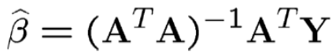

# Overview
A Linear Regression model implemented from scratch using Vector Calculus approach to predict the class of an Iris plant

# Dataset
The dataset is obtained from the [UCI Machine Learning Repository](https://archive.ics.uci.edu/ml/datasets/Iris) and contains 3 classes of 
50 instances each, where each class refers to a type of iris plant. The file is comma separated and the fields/attributes in each record are as follows


## Features

* Sepal Length in cm
* Sepal Width in cm
* Petal Length in cm
* Petal Width in cm

## Label
The class of the plant 
* Iris Setosa
* Iris Versicolour
* Iris Virginica

## Sample Data
sepal length | sepal width | petal length | petal width | class
---|---|---|---|---
5.1|3.5|1.4|0.2|Iris-setosa
4.9|3.0|1.4|0.2|Iris-setosa
4.7|3.2|1.3|0.2|Iris-setosa
4.6|3.1|1.5|0.2|Iris-setosa

# The Algorithm
This model is implemented using Vector Calculus approach.



Where,

* β - A column vector of co-efficients
* A - The feature vectors
* Y - The label vectors
# Requirements
## Platform
* Operating System - Linux or Windows
* Python - 3.6.5
## Libraries
Although this model is implemented without using any libraries for the core calculations, 
`csv`,`random` and `math` are used to conveniently load the data and shuffle it during cross validation. 
These libraries are available with the default installation of python.

In case these libraries aren't available on the target machine, they can be installed using
```bash
$ pip install csv random math
```
# Implementation
The label field of the dataset is transformed into a numeric value by assigning the following numbers for each class

class| number
---|---
Iris-setosa|0
Iris-versicolor|1
Iris-virginica|2

The predicted numeric value is then approximated to the nearest integer as shown in the examples below
and are used to look-up for the respective predicted label. 

Example
* 1.03 is approximated to 1. Hence the label predicted is Iris-versicolor
* 1.5 is approximated to 2. Hence the label predicted is Iris-virginia 

## Project structure
```bash
<project home>
├── data
│   └── iris.data   # The Dataset
├── main.py         # To use the model and predict the class of the plant
├── models.py       # Implementation of the Linear Regression model
└── README.md
```
## Classes
### LinearRegression
This class contains the code to perform Linear Regression on the given dataset. The logic is divided across the following methods

#### __init__(file)  
The class constructor. Loads the dataset into the model, separates the features and labels

Param | Type | Description
---|---|---
file|string| The path to the dataset(iris.data)
#### dot(mat1, mat2)
Return the dot product of matrices `mat1` and `mat2`. 

Parameter | Type | Description
---|---|---
mat1|list[list]|An **MxN** matrix loaded as a list of lists
mat2|list[list]|An **NxM** matrix loaded as a list of lists
#### transpose(mat)
Returns the transpose of the matrix `mat`

Parameter | Type | Description
---|---|---
mat|list[list]|The **MxN** matrix to be transposed
#### inverse(mat)
Returns the inverse of the matrix `mat`. Inverse is calculated using determinant & cofactor approach. 

Parameter | Type | Description
---|---|---
mat|list[list]|The **MxN** matrix to be inverted.
#### fit(passes, split)
This function does the following. 
1. Divides the dataset into training set (`A_train`, `Y_train`) and testing set(`A_test`,`Y_test`) according to the value of `split` parameter
2. Calculates the co-efficients(beta vector) using the equation described in The Algorithm section using the methods - `dot()`,`transpose()` and `inverse()` on the `A_train` matrix and `Y_train` vector 
3. Uses the calculated beta values to predict labels of the test dataset, prints the predicted and actual labels calculates the accuracy of the model as a ratio of number of correctly predicted labels to number of records in the test data set 

The above steps are repeated `passes` number of times by shuffling the data every-time to observe how the model learns 
when trained using different permutations of records in the dataset

Parameter | Type | Description
---|---|---
split|float[0-1]|The percentage of the dataset to be used for training. The remaining will be used as test set 
passes|int|The number of times the model needs to be trained and evaluated

#### predict(A_test, Y_test)
Uses the calculated beta vector to predict the label of a given flower.

Parameter | Type | Description
---|---|---
A_test|list| The feature vector for which the label needs to be predicted. Eg. `[6.8,3.2,5.9,2.3]`
Y_test|list| The actual label of `A_test` from the dataset. This is used to validate whether the model predicted the label correctly

# How to Run
```bash
# Unzip the project archive
# cd into project directory
# Run the project using the command : python main.py [number of passes] [trian data split percentage]

# Example
$ unzip project1.zip
$ cd project1
$ python main.py 2 0.8
```
> Number of passes and split percentage are optional. They are set to 2 passes and 72:28 split ratio by default 
> after experimenting with various split ratios several times
# Cross-Validation
In order to verify the model, the dataset is divided into training set and test set in the ratio 72% and 28% by default. 
This ratio can be changed at runtime by passing arguments for the `main.py` as shown below.
```bash
$ python main.py 3 0.85
```
# Evaluation
The project was executed several times to observe how the model learns when trained on different permutations of records
from the dataset and here's a summary of observations

Number of passes|Train data|Test Data| Avg. Accuracy|Remarks
---|---|---|---|---
3|72%|28%|95.24%| Sometimes the model learns too well from the data
2|80%|20%|94.9%|
2|85%|15%|95.652| Accuracy fluctuated between 91% to 100%

## Sample outputs
### 3 passes with 72% of data for training and 28% for testing
```bash
/home/harsha/anaconda3/envs/p365/bin/python /home/harsha/github/projects/python/cse6331/cse6331-p1/main.py
Pass#: 1 	 Train Records: 108 	 Test Records: 42
	Predicted: Iris-virginica(1.942), Actual: Iris-virginica(2), Error: -0.058
	Predicted: Iris-versicolor(0.857), Actual: Iris-versicolor(1), Error: -0.143
        ...
        ...
        ...
	Predicted: Iris-versicolor(1.261), Actual: Iris-versicolor(1), Error: 0.261
	Predicted: Iris-setosa(-0.036), Actual: Iris-setosa(0), Error: -0.036
	Predicted: Iris-virginica(2.033), Actual: Iris-virginica(2), Error: 0.033
Accuracy = 100.000 % 	 Average Error: 0.068


Pass#: 2 	 Train Records: 108 	 Test Records: 42
	Predicted: Iris-setosa(-0.082), Actual: Iris-setosa(0), Error: -0.082
	Predicted: Iris-virginica(1.856), Actual: Iris-virginica(2), Error: -0.144
	Predicted: Iris-versicolor(1.353), Actual: Iris-versicolor(1), Error: 0.353
        ...
        ...
        ...
	Predicted: Iris-virginica(2.135), Actual: Iris-virginica(2), Error: 0.135
	Predicted: Iris-virginica(1.784), Actual: Iris-virginica(2), Error: -0.216
Accuracy = 97.619 % 	 Average Error: 0.006


Pass#: 3 	 Train Records: 108 	 Test Records: 42
	Predicted: Iris-setosa(0.183), Actual: Iris-setosa(0), Error: 0.183
	Predicted: Iris-versicolor(1.090), Actual: Iris-versicolor(1), Error: 0.090
        ...
        ...
        ...
	Predicted: Iris-versicolor(0.861), Actual: Iris-versicolor(1), Error: -0.139
	Predicted: Iris-setosa(-0.031), Actual: Iris-setosa(0), Error: -0.031
Accuracy = 88.095 % 	 Average Error: 0.027
```

### 2 passes with 80% of data for training and 20% for testing
```bash
/home/harsha/anaconda3/envs/p365/bin/python /home/harsha/github/projects/python/cse6331/cse6331-p1/main.py
Pass#: 1 	 Train Records: 120 	 Test Records: 30
	Predicted: Iris-virginica(2.015), Actual: Iris-virginica(2), Error: 0.015
	Predicted: Iris-versicolor(0.828), Actual: Iris-versicolor(1), Error: -0.172
	Predicted: Iris-virginica(1.603), Actual: Iris-versicolor(1), Error: 0.603
        ...
        ...
        ...	
	Predicted: Iris-setosa(-0.096), Actual: Iris-setosa(0), Error: -0.096
	Predicted: Iris-setosa(-0.210), Actual: Iris-setosa(0), Error: -0.210
Accuracy = 96.667 % 	 Average Error: 0.000


Pass#: 2 	 Train Records: 120 	 Test Records: 30
	Predicted: Iris-virginica(1.716), Actual: Iris-virginica(2), Error: -0.284
	Predicted: Iris-setosa(0.015), Actual: Iris-setosa(0), Error: 0.015
	Predicted: Iris-virginica(1.574), Actual: Iris-virginica(2), Error: -0.426
	Predicted: Iris-virginica(1.747), Actual: Iris-virginica(2), Error: -0.253
        ...
        ...
        ...	
	Predicted: Iris-versicolor(1.238), Actual: Iris-versicolor(1), Error: 0.238
	Predicted: Iris-virginica(1.935), Actual: Iris-virginica(2), Error: -0.065
Accuracy = 93.333 % 	 Average Error: 0.063
```
### 2 passes with 85% data for training and 15% for testing
```bash
Pass#: 1 	 Train Records: 127 	 Test Records: 23
	Predicted: Iris-virginica(1.714), Actual: Iris-virginica(2), Error: -0.286
	Predicted: Iris-virginica(1.547), Actual: Iris-versicolor(1), Error: 0.547
	Predicted: Iris-setosa(-0.215), Actual: Iris-setosa(0), Error: -0.215
        ...
        ...
        ...		
	Predicted: Iris-virginica(1.839), Actual: Iris-virginica(2), Error: -0.161
	Predicted: Iris-virginica(1.830), Actual: Iris-virginica(2), Error: -0.170
Accuracy = 91.304 % 	 Average Error: -0.027


Pass#: 2 	 Train Records: 127 	 Test Records: 23
	Predicted: Iris-virginica(1.553), Actual: Iris-virginica(2), Error: -0.447
	Predicted: Iris-versicolor(1.377), Actual: Iris-versicolor(1), Error: 0.377
	Predicted: Iris-setosa(-0.084), Actual: Iris-setosa(0), Error: -0.084
        ...
        ...
        ...		
	Predicted: Iris-setosa(-0.143), Actual: Iris-setosa(0), Error: -0.143
	Predicted: Iris-virginica(1.567), Actual: Iris-virginica(2), Error: -0.433
Accuracy = 100.000 % 	 Average Error: -0.067
```
# References/Resources
1. https://archive.ics.uci.edu/ml/datasets/Iris
2. https://stackoverflow.com/questions/32114054/matrix-inversion-without-numpy
